# Web interface

The web interface of Proof Market can be accessed at [proof.market](https://proof.market).


Please note this product is in beta and expected to change.


## Creating an account 

To interact with Proof Market, create an account at [proof.market](https://proof.market/#/register)
or [through the command-line interface](cmd-reference/user.md).
Without an account, you can view the exchange, but you won't be able to post orders 
to buy or sell proofs.

To register a new user via the web interface, go to the [Sign up](https://proof.market/#/register)
page or select **Sign in** > **Sign up** from the main page:

<figure>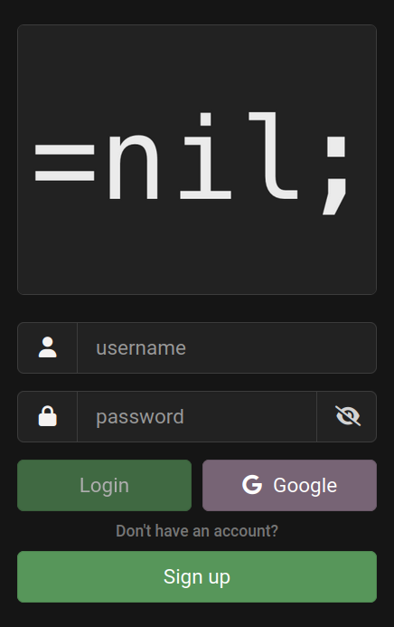<figcaption>
Sign in view
</figcaption></figure>

Enter your username and password and complete the flow by clicking on **Register**.

<figure>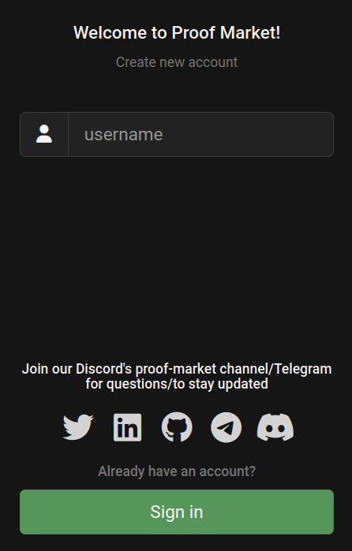<figcaption>
Registration view
</figcaption></figure>

## Logging in

If you're a registered user, go to the [Sign in](https://proof.market/#/login) page, enter your credentials in the provided fields, and click **Login**.

<figure><figcaption>
Sign in view
</figcaption></figure>

## Dashboard

The Proof Market dashboard has the following components:

* [A: Statement list](front-end.md#statement-list);
* [B: Trades](front-end.md#trades);
* [C: Last proof producer](front-end.md#last-proof-producer);
* [D: Statement details](front-end.md#statement-details);
* [E: Statement dashboard](front-end.md#statement-dashboard);
* [F: Order book](front-end.md#order-book);
* [G: Create orders](front-end.md#create-orders);
* [H: Manage orders](front-end.md#manage-orders).

<figure>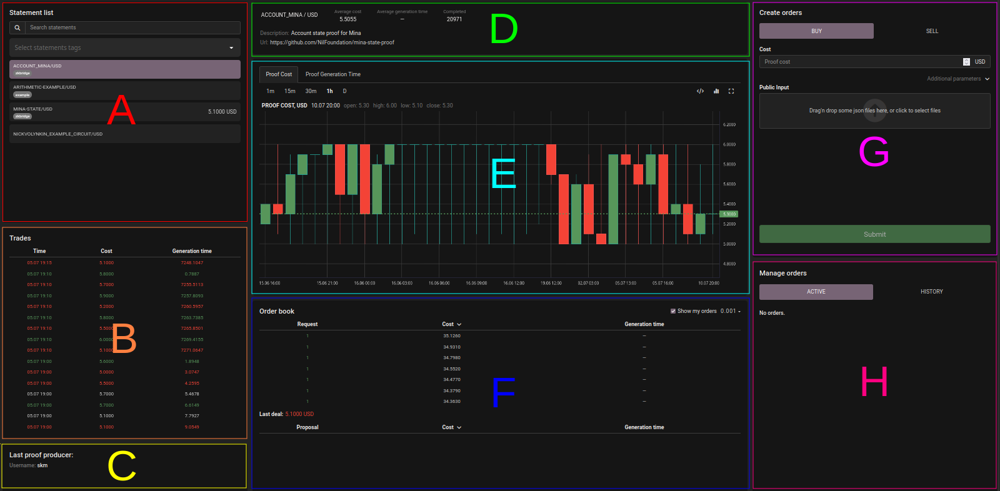<figcaption>
The Proof Market dashboard
</figcaption></figure>

If you're not logged in, **Create orders** and **Manage orders** sections will not be available.

### Statement list

The statements list shows the [statements](overview.md/#circuits-and-statements) available
on Proof Market, like MINA or Solana state-proofs, and their price change in the last 24 hours.
Here you can search the statements to create an order to buy or sell proofs.
Selection of a statement in this view also affects all the other components.

<figure>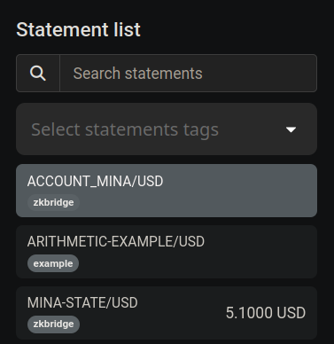<figcaption>
Circuit list view
</figcaption></figure>

### Trades

The trades component shows all the orders executed on the marketplace for the selected statement.

<figure>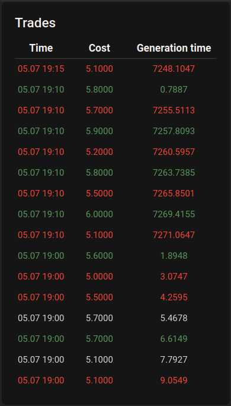<figcaption>
Trades view
</figcaption></figure>

### Last proof producer

This section shows the username of the last proof producer on the marketplace.

<figure><figcaption>
Last producer view
</figcaption></figure>

### Statement details

The statement details component shows the statement's description and URL along with its aggregated
marketplace stats, like average cost and generation time.

<figure>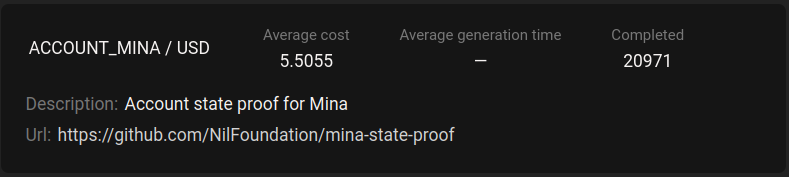<figcaption>
Statement details view
</figcaption></figure>

### Statement dashboard

This dashboard has two tabs:

* Proof cost — a history of the price settlement and amount of generated proofs for this statement.

<figure>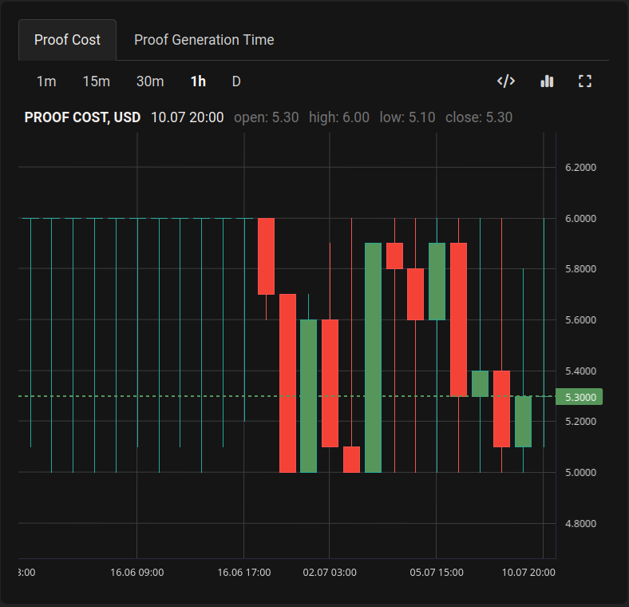<figcaption>
Proof cost
</figcaption></figure>

* Proof generation time — a history of how long did proof generation take from the time
  the order was matched to the time a proof was submitted to the market.

<figure>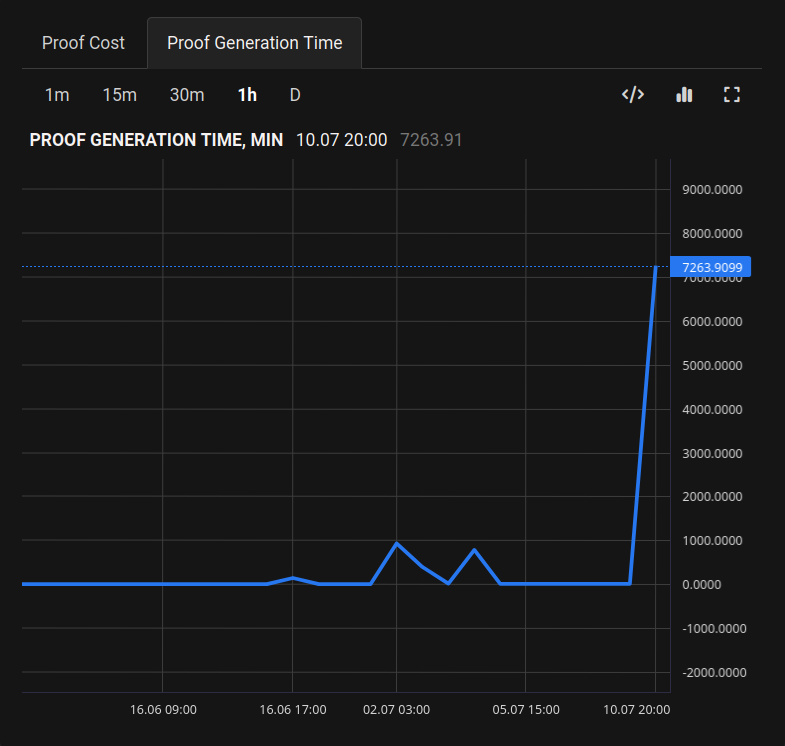<figcaption>
Proof generation time
</figcaption></figure>

### Order book

The order book shows the request and proposals on the marketplace for orders
which have not yet matched.

<figure>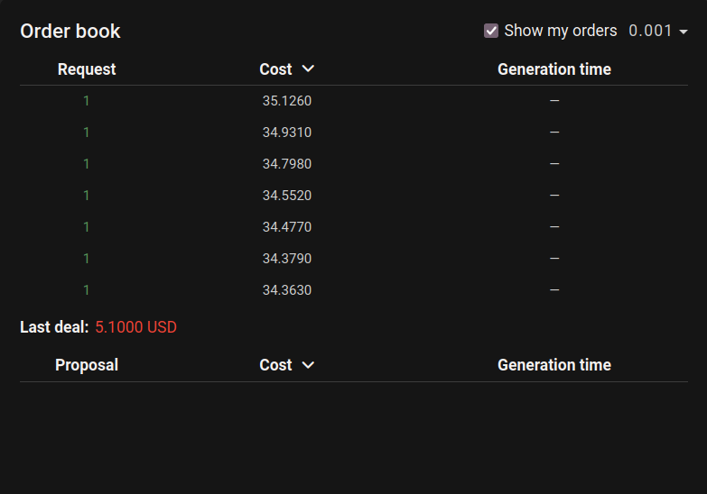<figcaption>
Order book view
</figcaption></figure>

You can toggle to see your orders in the book and group them.

### Create orders

**Create orders** section is active only for logged-in users.
Here you can place buy and sell orders.

You can learn more about orders and their fields in [Terminology](overview.md/#orders-types).
Please note that you should provide your inputs for the selected statement
in the **Public Input** field.

All users can post orders for buying proofs:

<figure>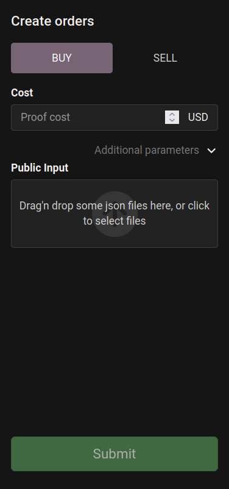<figcaption>
Buy order
</figcaption></figure>

If you are registered as a proof producer, you will also be able to post sell orders:

<figure><figcaption>
Sell order
</figcaption></figure>

Otherwise, you'll see this:

<figure>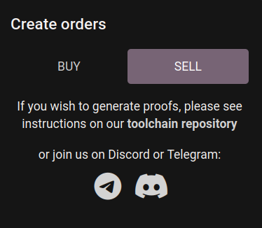<figcaption>
Sell order view for proof requesters
</figcaption></figure>

### Manage orders

**Manage orders** section is active only for logged-in users.
This view has two tabs:

* **Active orders** — all your currently [active orders](economics.md/#orders-status),
  waiting for a match or in processing.
  Here you can cancel an active order.

<figure>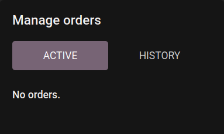<figcaption>
Manage orders view
</figcaption></figure>

* **History** — all your completed orders.
