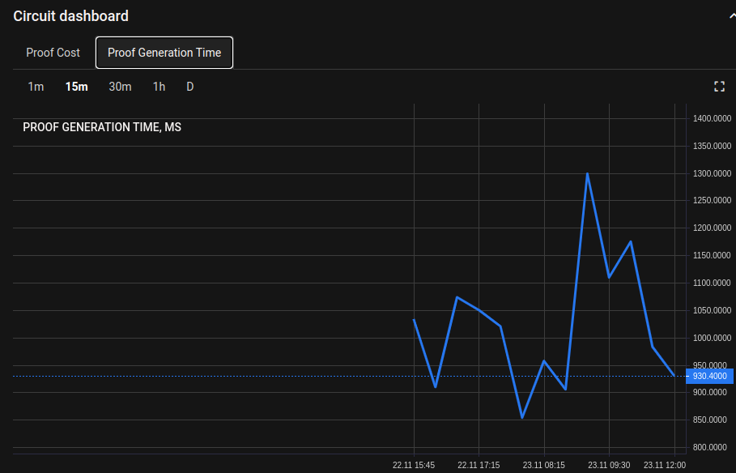
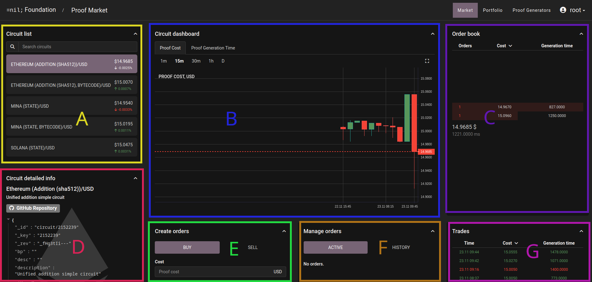

# Front End


Please note this product is in alpha and expected to change.


Proof Market front end can be accessed at : \[TODO ADD LINK]

## Login&#x20;

<figure><figcaption>
Login
</figcaption></figure>

Authenticated users should enter their credentials in the provided fields. &#x20;


Currently this is a closed alpha so users cannot signup.



If you do not have the credentials, users can still view the exchange, but they will be unable to post orders to buy/sell proofs.


## Dashboard

<figure><figcaption></figcaption></figure>

